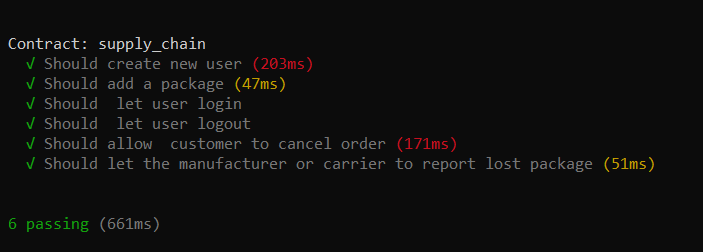
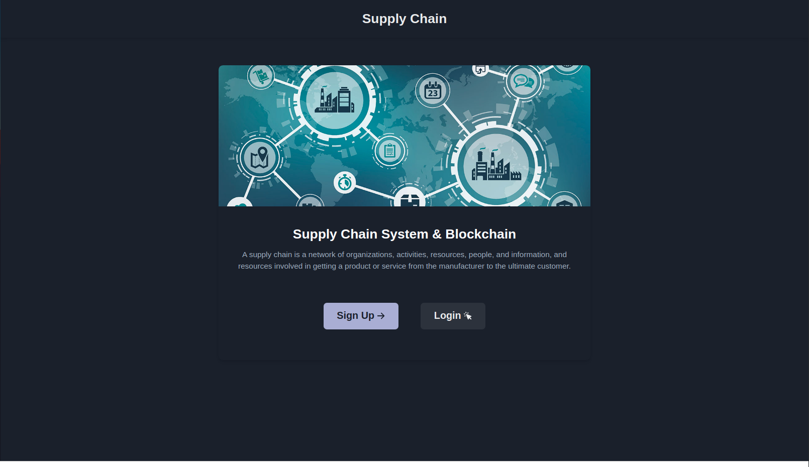
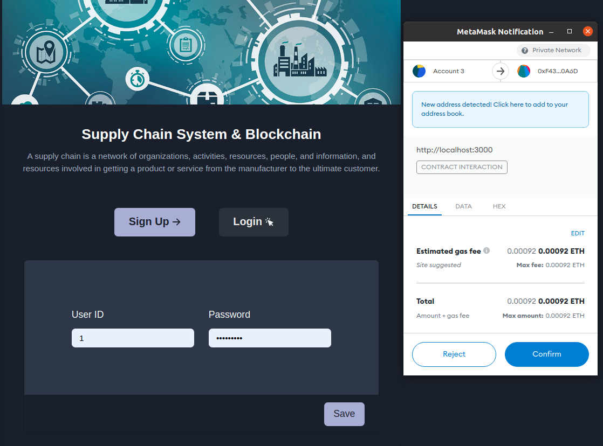

# Supply Chain React Dapp

A Decentralized App Representing a supply chain system

## Features

### General

- Contract address and unique IDs are used to identify users.
- Tests for all the important features in the contract.
- Using modifiers, require and revert to have a better control .
- Displaying error messages in the web interface.
- Different access level for each user (Customer, Manufacturer, Carrier).

### Manufacturer

- Login
- Create user
- Transfer package ownership
- Add a new package
- Report a lost package
- Trace a package
- Logout

### Carrier

- Login
- Transfer package ownership
- Report a lost package
- Trace a package
- Logout

### Customer

- Login
- Trace a package
- Logout

## Requirements

- [Metamask](https://metamask.io/)
- [React](https://reactjs.org/)
- [Truffle](https://www.trufflesuite.com/)
- [ganache](https://www.trufflesuite.com/ganache)
- [ChakraUI](https://chakra-ui.com/)
- Install required packages with `yarn install`

## Development

- Compile code via `truffle compile`
- Deploy to ganache using `truffle migrate`

## Contract Tests

- Tests are located in the test folder
- To run tests run `truffle test`

## Deployment

The contract is already deployed to the goerli test network using [infura](http://infura.io/). 

- Deployed contract address: [goerli](https://goerli.etherscan.io/address/0x03716C2de74Ad606D2EFbCC39e17FC51F327e7Ae).
- Run `truffle migrate --network goerli` to deploy to goerli test network

## Web Interface development

The user need to create an account based on their job, also with the help of metamask which will provide the app
with an account.

- To run the application you need to create `create react app` run `npx create-react-app my-app`
- Start the server using `yarn start`

## Some Notes

- Referesh the page after changing account in metamask.

## Web Interface Preview

# Landing page

# Login page

# View Package Details

![customer]!(./screens/image3.png)

# Transfer Ownership

![customer]!(./screens/image8.png)
